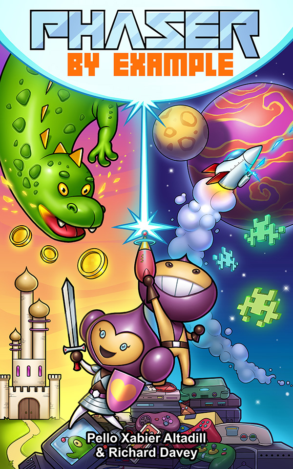

# Phaser By Example



This repo is including all the _9_ games written in the Phaser By Example book. All the games use Vite for bundling.

[Get the book here!](https://phaser.io/news/2024/04/phaser-by-example-book)

#### Installation:

```bash
cd project_name
npm install
npm run dev
```

For multiplayer examples, you need to have a build of client first, then run the Node.js server.

```bash
npm run build
node server.js
```

## Join the Phaser Community!

We love to see what developers like you create with Phaser! It really motivates us to keep improving. So please join our community and show-off your work 😄

**Visit:** The [Phaser website](https://phaser.io) and follow on [Phaser Twitter](https://twitter.com/phaser_)<br />
**Play:** Some of the amazing games [#madewithphaser](https://twitter.com/search?q=%23madewithphaser&src=typed_query&f=live)<br />
**Learn:** [API Docs](https://newdocs.phaser.io), [Support Forum](https://phaser.discourse.group/) and [StackOverflow](https://stackoverflow.com/questions/tagged/phaser-framework)<br />
**Discord:** Join us on [Discord](https://discord.gg/phaser)<br />
**Code:** 2000+ [Examples](https://labs.phaser.io)<br />
**Read:** The [Phaser World](https://phaser.io/community/newsletter) Newsletter<br />

Created by [Phaser Studio](mailto:support@phaser.io). Powered by coffee, anime, pixels and love.

The Phaser logo and characters are &copy; 2011 - 2024 Phaser Studio Inc.

All rights reserved.
